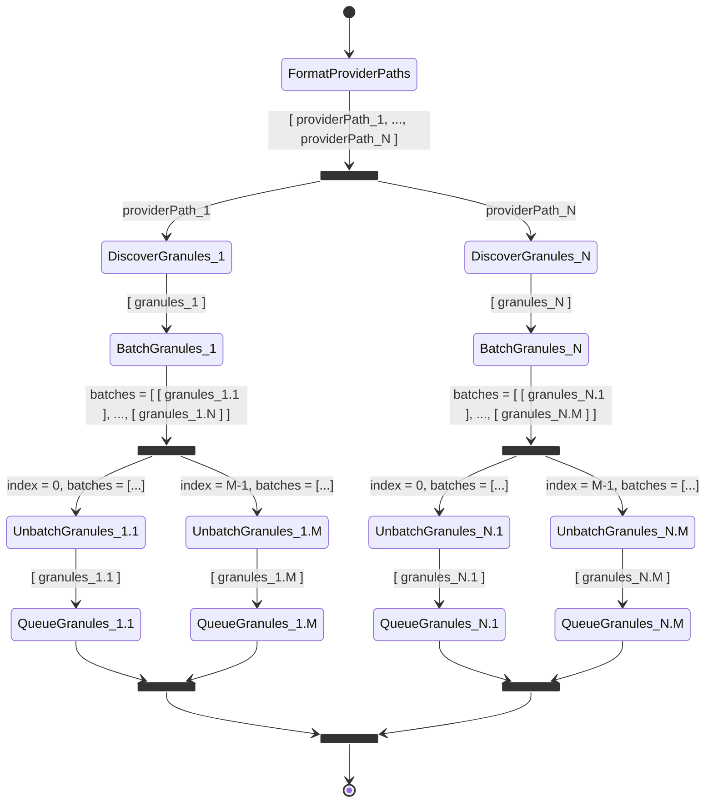

# Scalable Granule Discovery

Scalable Granule Discovery is our solution for overcoming the inherent
scalability limits in Cumulus's out-of-box implementation of granule discovery
and queueing.

- [Motivation](#motivation)
- [Problem Illustration](#problem-illustration)
- [Original Solution (Limited Scalability)](#original-solution-limited-scalability)
  - [Discovery Chunking](#discovery-chunking)
  - [Implementation](#implementation)
  - [Caveats](#caveats)
- [Improved Solution (Unlimited Scalability)](#improved-solution-unlimited-scalability)
- [Relevant Source Code](#relevant-source-code)

## Motivation

Out of the box, **Cumulus inadvertenly limits the volume of files that can be
discovered during a single execution of granule discovery** because it employs a
naive implementation that assumes the entire list of discovered files will fit
into memory.  Clearly, if the list of files is too large, the discovery step of
the workflow will run **out of memory**, and the workflow will crash.

It is also possible for the discovery step to **timeout**, which can occur when
the list of discovered files is large, but not quite large enough to exceed
available memory.  In this case, it might not be able to list and queue all of
the discovered granules before a timeout occurs.

One solution to these time and space constraints is to move the discovery step
from a Lambda Function to an EC2 Task, which does allow for more memory and
time, but which simply kicks the proverbial can down the road.  At some point,
it is still possible to exceed these expanded limitations.

While these problems are generally unlikely to occur in the course of forward
processing, they are very likely to occur during historical processing of large
data sets.

## Problem Illustration

To illustrate the problem, suppose we have granule files in an S3 Bucket named
`planet-bucket`, and that the following is a sample of these files, showing the
files for a single granule in the collection (paths abridged):

```plain
path/to/PSScene3Band-20171215_154051_0f31/.../20171215_154051_0f31_1B_Analytic.tif
path/to/PSScene3Band-20171215_154051_0f31/.../20171215_154051_0f31_1B_Analytic_RPC.TXT
path/to/PSScene3Band-20171215_154051_0f31/.../20171215_154051_0f31_1B_Analytic_metadata.xml
path/to/PSScene3Band-20171215_154051_0f31/.../20171215_154051_0f31_1B_Analytic_DN_udm.tif
path/to/PSScene3Band-20171215_154051_0f31/.../20171215_154051_0f31_cmr.json
path/to/PSScene3Band-20171215_154051_0f31/.../20171215_154051_0f31_metadata.json
path/to/PSScene3Band-20171215_154052_0f31/.../20171215_154052_0f31_1B_Analytic.tif
path/to/PSScene3Band-20171215_154052_0f31/.../20171215_154052_0f31_1B_Analytic_RPC.TXT
path/to/PSScene3Band-20171215_154052_0f31/.../20171215_154052_0f31_1B_Analytic_metadata.xml
path/to/PSScene3Band-20171215_154052_0f31/.../20171215_154052_0f31_1B_Analytic_DN_udm.tif
path/to/PSScene3Band-20171215_154052_0f31/.../20171215_154052_0f31_cmr.json
path/to/PSScene3Band-20171215_154052_0f31/.../20171215_154052_0f31_metadata.json
```

In order to discover (and subsequently ingest) _all_ of the (historical) files
in the collection, we must define a _provider_, like so:

```json
{
  "id": "planet",
  "protocol": "s3",
  "host": "planet-bucket"
}
```

In addition, we must define an appropriate _rule_:

```json
{
  "name": "PSScene3Band___1",
  "state": "ENABLED",
  "provider": "planet",
  "collection": {
    "name": "PSScene3Band",
    "version": "1"
  },
  "workflow": "DiscoverAndQueueGranules",
  "rule": {
    "type": "onetime"
  },
  "meta": {
    "providerPath": "path/to/PSScene3Band",
  }
}
```

Given the provider and rule definitions above, running the rule would cause the
following to occur:

1. Trigger the `DiscoverAndQueueGranules` workflow (AWS Step Function)
1. List all files with S3 URIs that have a _prefix_ of
   `s3://planet-bucket/path/to/PSScene3Band`
1. Group files by granule
1. Queue message for each granule (with its list of associated files)
1. Trigger `IngestAndPublishGranule` workflow for each queued message

where:

- The **workflow** (`DiscoverAndQueueGranules`) is specified by the `"workflow"`
  property in the rule definition above
- The **S3 URI prefix** is constructed using the format
  `s3://PROVIDER_HOST/PROVIDER_PATH`, where `PROVIDER_HOST` is the value of the
  `"host"` property in the provider definition, and `PROVIDER_PATH` is the value
  of the `"meta.providerPath"` property in the rule definition

In this example, the discovery step will attempt to discover _all_ granules in
the `PSScene3Band` collection (version `1`) _at once_.  For relatively small
collections (very roughly no more than 500K files), this generally works without
issue, but for larger collections, attempting to list _all_ files in the
collection in memory at once will cause an "out of memory" error (or possibly
cause a timeout, while queuing messages for granule ingestion/publication).

## Original Solution (Limited Scalability)

> **UPDATE:** This solution has been superceded by the solution described in the
following section, but its description remains here for those interested in
understanding the history of our scalability journey.

### Discovery Chunking

Although, for large enough collections, we cannot successfully discover _all_
granules in a collection in a _single_ discovery step, we can divide the files
into groups such that each group is small enough to be discovered separately
from one another.

Notice that the date (`20171215`, in our example above) is included in all of
the file paths.  This means that we can be more precise with the value of
`"meta.providerPath"` specified in our rule.  For example, we could limit
discovery to the single year 2017 by setting `"meta.providerPath"` to
`"path/to/planet/PSScene3Band-2017"`, or even limit it to the single month
December 2017 by setting it to `"path/to/planet/PSScene3Band-201712"`.

By specifying a more precise value for `"meta.providerPath"`, we can avoid
hitting our time and space constraints because a more precise value will result
in a smaller list of files during discovery.  However, for large collections,
the manual effort required to discover each group of granules would be
laborious, pains-taking, and error-prone.

### Implementation

Therefore, we have implemented a relatively simple solution that _automates_
both the creation of more precise `"meta.providerPath"` values (as described
above), as well as the advancing of these values over sequential date ranges.
This enables discovering a practically unlimited number of files without memory
limitations and with a timeout that can be extended to as long a 1 year, which
is the limit for Step Functions.

To enable this automation, this solution adds support for the following new
properties within a rule's `"meta"` section (see farther below for an
explanation of how they're used):

- `"providerPathFormat"`: a date format used in combination with `"startDate"`
  to dynamically generate a value for `"providerPath"`.  This format must adhere
  to the [date-fns format specification].  Note also that both of the [date-fns
  format options] `useAdditionalWeekYearTokens` and
  `useAdditionalDayOfYearTokens` are set to `true` to allow the use of the
  tokens `YY`, `YYYY`, `D` and `DD`.
- `"startDate"`: the UTC start date for discovery, in [ISO 8601] format
- `"endDate"` (optional): the UTC end date for discovery, also in ISO 8601
  format
- `"step"` (optional): an [ISO 8601 Duration] to limit the number of granules
  discovered at once

The general algorithm for achieving this automatic, incremental discovery is as
follows:

1. If `"endDate"` is not specified, set it to the current date/time.
1. Format the `"startDate"` using the `"providerPathFormat"` as the date format
   to generate the value for `"providerPath"`.
1. Discover and queue granules with a path that starts with the value of
   `"providerPath"`.  Normally, this would be the last step of the workflow.
1. If `"step"` is specified, generate a new value for `"startDate"` by adding
   `"step"` to the current `"startDate"`.  Otherwise, set the new `"startDate"`
   to the `"endDate"`.
1. If the new `"startDate"` is less than the `"endDate"`, go to step 2.
   Otherwise, end the workflow.  Note that the start date must be _strictly_
   less than the end date because the end date is _excluded_ from the range for
   discovery (akin to how a `range` in Python _excludes_ the end value of the
   range).

Returning to our example from above, we can now discover _all_ granules in our
collection, without hitting our time and space constraints, by simply changing
the `"meta"` properties in our rule definition, as follows:

```json
"meta": {
  "providerPathFormat": "'path/to/PSScene3Band-'yyyyMM",
  "startDate": "2016-01",
  "step": "P1M"
}
```

Based on the algorithm outlined above, running our rule with these property
changes will perform the following steps:

1. `"endDate"` is not specified, so it is set to the current date/time.
1. Format the `"startDate"` (`"2016-01"`) using the format
   `"'path/to/PSScene3Band-'yyyyMM"` to generate
   `"path/to/PSScene3Band-201601"` as the value of `"providerPath"`.
1. Discover and queue all granules generated in January 2016 (as dictated by
   the value of `"providerPath"` from the previous step).
1. Add 1 month (a duration of `"P1M"` specified by `"step"`) to `"startDate"` to
   obtain a new `"startDate"` value of `"2016-02"` (more specifically,
   `"2016-02-01T00:00:00Z"`).
1. Format the date `"2016-02-01T00:00:00Z"` using the format
   `"'path/to/PSScene3Band-'yyyyMM"` to generate
   `"path/to/PSScene3Band-201602"` as the value of `"providerPath"`.
1. Discover and queue all granules generated in February 2016 (as dictated by
   the value of `"providerPath"` from the previous step).
1. Add 1 month (a duration of `"P1M"` specified by `"step"`) to `"startDate"` to
   obtain a new `"startDate"` value of `"2016-03"` (more specifically,
   `"2016-03-01T00:00:00Z"`).
1. ...and so on, until `"startDate"` reaches or exceeds `"endDate"` (the current
   date in this case, since `"endDate"` is not explicitly specified above).

In other words, with the `"meta"` changes above, we can ingest _all_ of the
granules in the collection, one month at a time, in a single execution of the
`DiscoverAndQueueGranules` workflow, without running out of memory or time
(assuming we can do so within a year, the maximum timeout for a Step Function).

### Caveats

While the solution described above serves us much better than without it,
we ran into the following problems:

1. Some collections capture enough granules within the timeframe of a single
   month to still cause either the discover or queue step to either run out of
   memory or time.  However, this was seemingly easy to fix: we shrunk the step
   size to 1 day, rather than 1 month.

1. Unfortunately, the fix for the first problem, led us to a second problem:
   reaching the AWS quota on state transitions within Step Function executions.

   AWS limits us to 25,000 state transitions per execution.  This might seem to
   be hard to reach, but some back-of-the-napkin math shows that given a Step
   Function that produces 20 state transitions when discovering and queueing a
   single day's worth of granules (i.e., using a `"step"` value of `"P1D"`
   [1 day], rather than `"P1M"` [1 month]) means that we'll hit that limit prior
   to processing 3 1/2 years of data:

   ```plain
   25,000 transitions / 20 transitions per day / 365 days per year ~= 3.4 years
   ```

To address the limitation on the state transitions, this solution forced us to
create multiple Cumulus rules per collection.  Rather than creating rules
spanning 3 years (to stay well enough under the ~3.4-year limit), we chose to
create 1 rule per year per collection for slightly more convenient rule
management.  While this is still far more convenient than the effort required
without this solution, it is still not ideal for at least the following reasons:

- We cannot ingest an entire collection in a single go.  When ingesting a
  collection spanning many years, we are forced to trigger ingestion 1 year at a
  time, which not only adds to the manual effort, it also often leads to
  lengthier overall time for ingesting an entire collection due to time often
  lost overnight, from dead time occurring between the end of the ingestion of a
  particular year of data and the start of the ingestion of the next year of
  data whenever somebody starts the next work day.
- We end up with a proliferation of rules.  For example, if we have 10
  collections with an average span of 10 years each, we end up with 100 rules.

The ideal solution would allow us to define 1 rule per collection, regardless of
how many years a collection covers.

## Improved Solution (Unlimited Scalability)

With the
[AWS announcement of the availability of a distributed map for Step Functions]
in December 2022, it is now possible to achieve our ideal solution for
discovering and ingesting an entire collection through a single rule.  This is
possible because the state transitions of a _distributed map_ state do _not_
count toward the quota of the main step function.

Therefore, our current solution replaces the discovery looping (from our
previous solution) with a distributed map state.  In effect, this means that
instead of sequentially discovering each group of granules for each day in the
temporal range of a collection, each day of granules are discovered
_concurrently_ (with a configurable concurrency limit), with the state
transitions for _each_ day counted independently (i.e., each gets a separate
quota, thus handily avoiding reaching the limit).

In addition, a second (inline, not distributed) map state is included for
further dividing discovered granules for each day into smaller batches before
being queued.  This produces further concurrency, as each batch of granules is
queued concurrently (again, with a configurable concurrency limit).

The following state diagram depicts the primary logic of the
`DiscoverAndQueueGranules` step function encoded in
`app/stacks/cumulus/templates/discover-granules-workflow.asl.json` (excluding
minor details specific to this project):



The logic is as follows:

1. `FormatProviderPaths` produces _N_ provider paths (S3 key prefixes), one for
   each day (resolution) of the temporal range of the collection being processed
   by the rule that triggered the workflow.  The temporal resolution and range
   are configured in the rule definition.  (NOTE: a temporal resolution of 1
   day, "P1D", is strongly recommended, not only to maximize concurrency, but
   also to minimize the potential for crashing the `DiscoverGranules` Lambda
   function.)
1. A _distributed map_ state _concurrently_ discovers granules for each provider
   path (maximum concurrency is configurable, and handled automatically by AWS),
   represented by `DiscoverGranules_1` through `DiscoverGranules_N`, which are
   invocations of the standard Cumulus `DiscoverGranules` Lambda function.
1. For each `DiscoverGranules` (1..._N_), a custom `BatchGranules` Lambda
   function splits the discovered granules into _M_ batches.  The maximum batch
   size is configurable in the rule definition, defaulting to 1,000.
1. An _inline map_ state _concurrently_ "unbatches" a distinct batch of granules
   via a custom `UnbatchGranules` Lambda function.
1. For each `UnbatchGranules` (1..._M_), the standard Cumulus `QueueGranules`
   Lambda function queues a distinct batch of granules.

The most important aspect of this logic is the _distributed map_ state that
concurrently discovers a timespan (1 day, ideally) of the collection's temporal
range, because the distributed map state is what allows us to avoid reaching
the event transition quota.

The splitting of each day of granules into even smaller batches is not necessary
for avoiding the event transition quota, and strictly speaking, isn't at all
necessary.  However, it does potentially further increase concurrency, but more
importantly, it accounts for outliers, where there are unusually large numbers
of granules for a particular day.  In such cases, it is possible to crash the
`QueueGranules` Lambda function.  Alternatively, to avoid such crashes, the
`QueueGranules` Lambda function can be run instead as an ECS task, but that's a
heavier approach, and it doesn't allow for concurrency (in the absence of a map
state).

This improved solution adds only 1 new "meta" property to rules, but for
completeness, here is the entire list of properties in a rule's `"meta"` block
used by this algorithm:

- `"providerPathFormat"`: see previous section
- `"startDate"`: see previous section
- `"endDate"` (optional): see previous section
- `"step"` (optional): see previous section
- `"maxBatchSize"` (optional): maximum number of granules (default: 1,000)
  within each batch of granules produced by the `BatchGranules` Lambda function.

  The `BatchGranules` function divides the number of discovered granules by the
  maximum batch size to determine the number of batches to produce, then evenly
  distributes the granules across the batches.

  For example, if there are 1,001 granules and the maximum batch size is 1,000,
  there must be 2 batches.  However, instead of creating a batch of 1,000
  granules and another batch of 1 granule, the function would produce a batch of
  501 granules and another batch of 500 granules to optimize throughput.

## Relevant Source Code

The relevant source code files are as follows:

- `app/stacks/cumulus/templates/discover-granules-workflow.asl.json`: template
  file defining the Step Function that implements this algorithm
- `app/stacks/cumulus/main.tf`: contains `module "discover_granules_workflow"`
  that references the Step Function template file above
- `src/lib/discovery.ts`: contains the Lambda functions that implement the logic
  for generating provider paths, batching granules, and unbatching granules

[AWS announcement of the availability of a distributed map for Step Functions]:
  https://aws.amazon.com/blogs/aws/step-functions-distributed-map-a-serverless-solution-for-large-scale-parallel-data-processing/
[date-fns format specification]:
  https://date-fns.org/docs/format
[date-fns format options]:
  https://date-fns.org/docs/format#arguments
[ISO 8601]:
  https://en.wikipedia.org/wiki/ISO_8601
[ISO 8601 Duration]:
  https://en.wikipedia.org/wiki/ISO_8601#Durations
